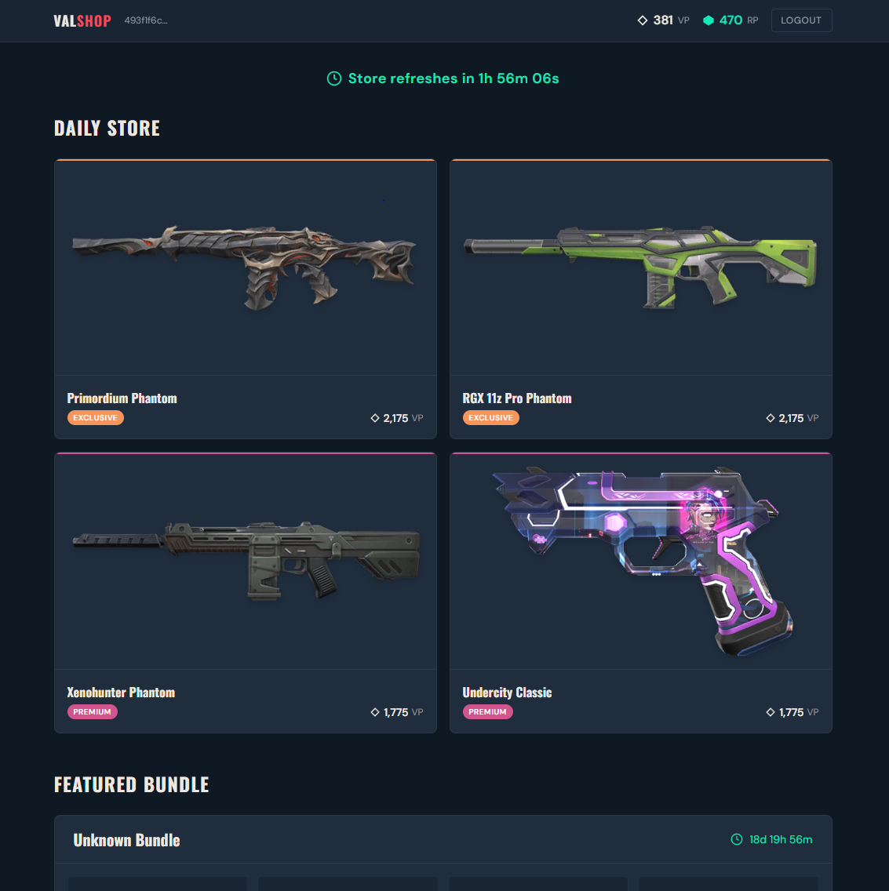

# Valorant Shop Checker

Check your Valorant daily store from any device — without launching the game.


A web app that lets Valorant players view their personalized daily shop rotation, featured bundles, and wallet balance from a browser. Built with a Python/FastAPI backend that handles Riot's OAuth authentication, and a React/TypeScript frontend with a Valorant-themed dark UI.



> **Disclaimer:** This application is not endorsed by Riot Games and does not reflect the views or opinions of Riot Games or anyone officially involved in producing or managing Riot Games properties. Riot Games and all associated properties are trademarks or registered trademarks of Riot Games, Inc.

## What It Does

- **Daily Store** — View your 4 daily rotating skin offers with content-tier indicators and VP prices
- **Featured Bundles** — See current bundles with item breakdowns and discount pricing
- **Wallet Balance** — Check your VP and Radianite Points
- **Auto-Refresh** — Countdown timer with automatic store refresh on rotation
- **Secure Auth** — Riot OAuth implicit-grant flow; your password never touches this app

## Tech Stack

| Layer | Technology |
|---|---|
| **Frontend** | React 19, TypeScript, Vite, Tailwind CSS 4, React Router |
| **Backend** | Python 3.12, FastAPI, httpx, uvicorn, Pydantic |
| **Auth** | Riot Games OAuth 2.0 implicit grant (`client_id=riot-client`) |
| **Asset Data** | [valorant-api.com](https://valorant-api.com) — skins, bundles, content tiers |
| **Deployment** | GitHub Pages (frontend), Render + Docker (backend), GitHub Actions CI/CD |

## Architecture

```
┌──────────────┐         ┌──────────────────┐        ┌──────────────────┐
│   Browser    │  HTTPS  │  FastAPI Backend  │  HTTPS │  Riot APIs       │
│  (React SPA) │◄───────►│  (Docker/Lightsail)│◄──────►│  auth, store,    │
│              │  JSON   │                  │        │  entitlements    │
└──────┬───────┘         └──────────────────┘        └──────────────────┘
       │                         │
       │  OAuth login            │  Startup
       ▼                         ▼
┌──────────────┐         ┌──────────────────┐
│  Riot Login  │         │ valorant-api.com │
│  (browser)   │         │ (asset cache)    │
└──────────────┘         └──────────────────┘
```

**Auth flow:** The user clicks "Sign In with Riot," which opens Riot's official login page. After authenticating, Riot redirects to `http://localhost/redirect#access_token=...` — since the app is deployed remotely, this shows a "can't connect" page, which is expected. The user copies the full URL from the address bar and pastes it into the app. The backend extracts the access token from the URL fragment and uses it to fetch entitlements, player info, and region data from Riot's APIs. A server-side session token is returned to the frontend and stored in `localStorage` for subsequent API calls.

## Design Decisions & Tradeoffs

| Decision | Why |
|---|---|
| **Paste-URL auth flow** | Riot's OAuth with `client_id=riot-client` enforces `redirect_uri=http://localhost/redirect` — no custom redirect URIs are allowed. Server-side credential auth was attempted but Riot blocks it with Cloudflare/captcha challenges. The paste-URL flow is the only reliable approach for a deployed web app. |
| **localStorage + Bearer tokens** (not cookies) | Cross-origin cookies are blocked by mobile Safari and other browsers with strict third-party cookie policies. `localStorage` with `Authorization: Bearer` headers works reliably across all platforms. |
| **sessionStorage for login stage** | Mobile browsers kill the JS context when the user switches tabs to complete Riot login. `sessionStorage` persists the UI state so the paste form survives tab switches. |
| **In-memory session store** | Simplicity over durability — sessions are short-lived (3h access token TTL) and the app targets a small user base. No database dependency needed. |
| **Asset cache at startup** | All skin/bundle/tier data is loaded from valorant-api.com into O(1) lookup dicts on startup, avoiding per-request API calls and keeping response times fast. |
| **Docker `--no-cache` in CI** | Docker's `COPY` layer caching caused stale deployments where code changes weren't reflected. `--no-cache` ensures every deploy uses fresh code. |

## Local Development

### Prerequisites

- Python 3.12+
- Node.js 18+

### Backend

```bash
cd backend
python -m venv .venv
source .venv/bin/activate    # Linux/macOS
# .venv\Scripts\activate     # Windows

pip install -e .
cp .env.example .env         # then fill in ENCRYPTION_KEY
uvicorn app.main:app --reload
```

The API runs at `http://localhost:8000`.

### Frontend

```bash
cd frontend
npm install
npm run dev
```

The dev server runs at `http://localhost:5173` and proxies `/api` requests to the backend.

## Deployment

Both pieces deploy free, straight from this GitHub repo.

| Component | Platform | Trigger |
|---|---|---|
| **Frontend** | GitHub Pages | Push to `master` when `frontend/` changes (via GitHub Actions) |
| **Backend** | Render (free web service, Docker) | Push to `master` (Render's own GitHub auto-deploy) |

### Frontend deployment

1. In the repo's Settings → Pages, set **Source** to "GitHub Actions".
2. In Settings → Secrets and variables → Actions → Variables, add a repository variable `VITE_API_URL` set to your Render backend URL (e.g. `https://valorant-shop-checker-backend.onrender.com`).
3. Push to `master` — `.github/workflows/deploy-frontend.yml` builds the app (with the correct `/repo-name/` base path for Pages) and deploys it.

### Backend deployment

1. On [Render](https://render.com), choose **New +** → **Blueprint**, and point it at this repo — it reads [`render.yaml`](render.yaml) and provisions a free Docker web service from `backend/Dockerfile`.
2. Set the `ALLOWED_ORIGINS` env var on the service to your GitHub Pages URL (e.g. `https://<username>.github.io`).
3. Every push to `master` redeploys automatically.

Note: Render's free tier spins the service down after ~15 minutes of inactivity. The first request after that takes ~30s to wake it up, and since sessions are stored in-memory ([session_store.py](backend/app/session_store.py)), any logged-in sessions are lost on that restart.

The old Lightsail workflow (`.github/workflows/deploy-backend.yml`) is no longer needed if you switch to Render — remove it once you've migrated, or keep it if you still deploy there too.

### Environment variables

See [`backend/README.md`](backend/README.md) and [`frontend/README.md`](frontend/README.md) for details.

## Project Structure

```
valorant-shop-checker/
├── backend/
│   ├── app/
│   │   ├── routers/       # API route handlers (auth, store)
│   │   ├── services/      # Riot API integration, asset cache, storefront
│   │   ├── models/        # Pydantic and dataclass models
│   │   ├── config.py      # App settings (pydantic-settings)
│   │   ├── session_store.py  # In-memory session management
│   │   └── main.py        # FastAPI app entry point
│   ├── Dockerfile
│   └── pyproject.toml
├── frontend/
│   ├── src/
│   │   ├── pages/         # LoginPage, ShopPage
│   │   ├── components/    # SkinCard, BundleCard, CountdownTimer, etc.
│   │   ├── api/           # API client with token management
│   │   ├── context/       # Auth state (useReducer)
│   │   └── types/         # TypeScript interfaces
│   ├── vite.config.ts
│   └── package.json
├── .github/workflows/     # CI/CD for backend deployment
└── README.md
```
